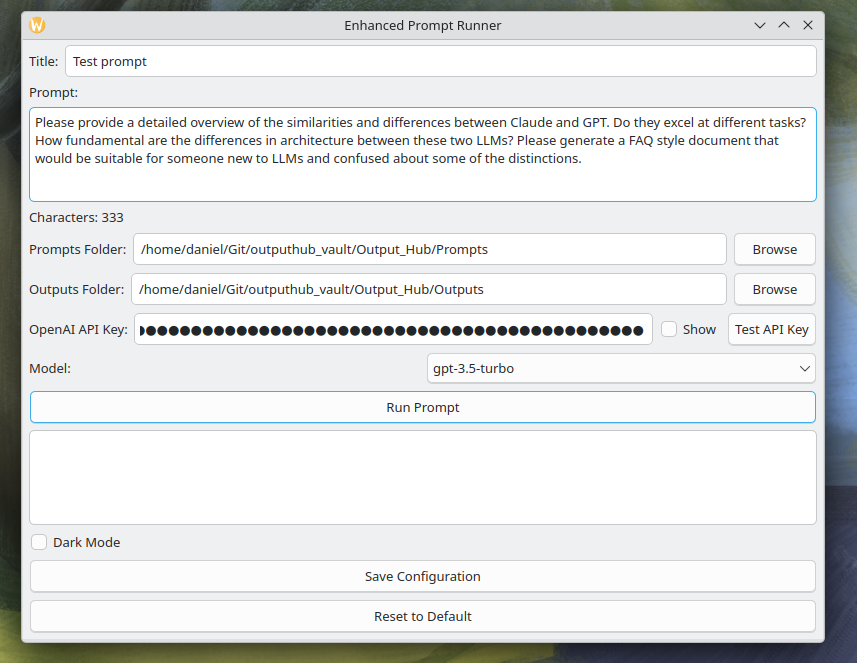

# Obsidian Vault prompt and output saving utility

## Purpose Statement

This program is a simple GUI for saving prompts and outputs into an Obsidian vault that is structured for saving LLM "things".

My Obsidian Vault has a structure that includes folders for:

```
/agents
/prompts
/outputs
```

... and is detailed in other repositories. 

## Requirements

You'll need an OpenAI API key to use this GUI.

## Screenshots (V1)

<table>
  <tr>
    <td></td>
    <td></td>
  </tr>
  <tr>
    <td></td>
    <td></td>
  </tr>
  <tr>
    <td></td>
    <td></td>
  </tr>
</table>


## Author

- Claude 3.5 Sonnet (AI)
- Daniel Rosehill  (human prompter!)
(public at danielrosehill dot com)

## Licensing

This repository is licensed under CC-BY-4.0 (Attribution 4.0 International) 
[License](https://creativecommons.org/licenses/by/4.0/)

### Summary of the License
The Creative Commons Attribution 4.0 International (CC BY 4.0) license allows others to:
- **Share**: Copy and redistribute the material in any medium or format.
- **Adapt**: Remix, transform, and build upon the material for any purpose, even commercially.

The licensor cannot revoke these freedoms as long as you follow the license terms.

#### License Terms
- **Attribution**: You must give appropriate credit, provide a link to the license, and indicate if changes were made. You may do so in any reasonable manner, but not in any way that suggests the licensor endorses you or your use.
- **No additional restrictions**: You may not apply legal terms or technological measures that legally restrict others from doing anything the license permits.

For the full legal code, please visit the [Creative Commons website](https://creativecommons.org/licenses/by/4.0/legalcode).